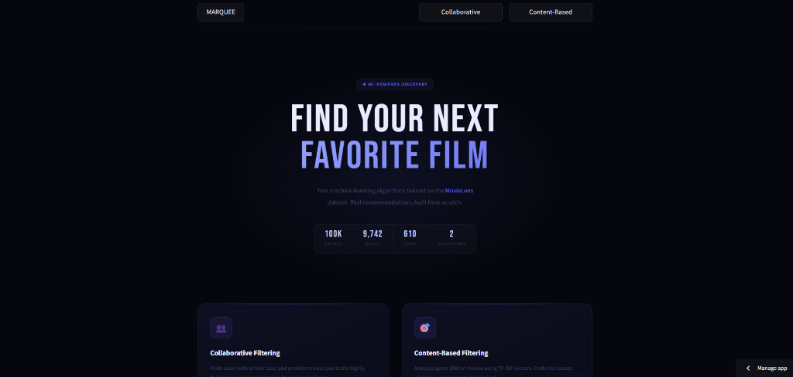

# Marquee 🎞️✨

**The intelligent movie recommendation engine.**

Marquee is a modern, full-stack movie discovery platform that combines fundamental machine learning with rich external metadata. Built completely with Python, it transforms the raw MovieLens dataset into a visual, context-aware discovery experience.

Live Demo: [Marquee on Streamlit](https://cf-movie-recommender.streamlit.app/)


_Note: To add your own screenshot, save a capture as assets/marquee_demo.png and push to Git._

---

## What makes Marquee different?

Most recommendation tutorials rely on high-level APIs or "black box" models. Marquee implements actual collaborative and content-based algorithms from the ground up, then layers on modern web features to create a polished portfolio project.

### 🧠 Dual-Engine Intelligence
- **User-Based Collaborative Filtering**: Computes a massive 610x610 user similarity matrix to predict what you'll love based on the tastes of similar film buffs.
- **Hybrid Content-Based Discovery**: A sophisticated blending engine that uses TF-IDF vectors from both movie genres and over 9,000+ TMDB keywords (like "street racing" or "superhero") to find deep semantic matches.
- **Gaussian Temporal Decay**: Automatically prioritizes movies from similar release eras, ensuring that if you're looking for modern blockbusters, the engine won't just dump 1940s classics on you.

### 🎨 Premium Visual Experience
- **Visual Search**: Real-time fuzzy search that renders high-quality movie posters as you type.
- **Combination Pool**: Add multiple movies to a "shopping cart" to find a single perfect recommendation that satisfies the intersection of all your inputs.
- **Deep Integrations**: Direct IMDb deep-links and real-time US streaming availability badges (HBO, Netflix, etc.) for every single recommendation.
- **Modern UI**: A sleek, glassmorphic dark-theme interface built with Custom CSS and the Outfit typography system.

---

## Tech Stack

| Layer | Technology |
|---|---|
| **Frontend / UI** | Streamlit, Custom CSS (Glassmorphism) |
| **Logic / ML** | Python, Scikit-Learn, Pandas, NumPy |
| **Data Enrichment** | TMDB API (Keywords, Posters, Streaming Providers) |
| **Dataset** | MovieLens Latest Small (100k+ ratings) |

---

## Getting Started

### Running Locally

1. **Clone the repository**:
   ```bash
   git clone https://github.com/muhammada138/movie-recommender.git
   cd movie-recommender
   ```

2. **Install dependencies**:
   ```bash
   pip install -r requirements.txt
   ```

3. **Launch the app**:
   ```bash
   streamlit run app.py
   ```

### Running Evaluation

To see the math behind the curtain and calculate the RMSE (Root Mean Square Error) of our custom models:
```bash
python evaluate.py
```

---

## Model Performance

Evaluated against a strict 80/20 train/test split.

| Method | RMSE (Lower is Better) |
|---|---|
| **Latent Factor SVD** | **0.9304** |
| User-Based Collaborative Filtering | 0.9764 |
| Global Mean Baseline | 1.0488 |

---

## Dataset & Citations

The project uses the [MovieLens Latest Small](https://grouplens.org/datasets/movielens/latest/) dataset which includes 100,836 ratings from 610 users on 9,742 movies.

> F. Maxwell Harper and Joseph A. Konstan. 2015. The MovieLens Datasets: History and Context. ACM Transactions on Interactive Intelligent Systems (TiiS) 5, 4: 22:1-22:19.
